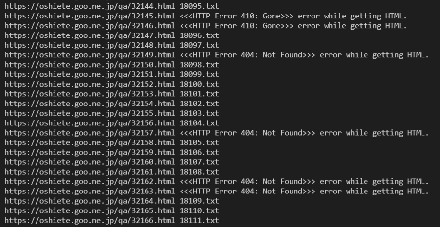

# Oshiete corpus getter

A toolkit for collating a multi-million word corpus from the Japanese Q&A site [oshiete.goo.ne.jp](https://oshiete.goo.ne.jp/)

I am currently collating a diachronic corpus of Japanese from the years 2001 and 2021 in order to observe changes in language usage over the last twenty years for a University course in corpus linguistics. I have chosen the website [oshiete.goo.ne.jp](https://oshiete.goo.ne.jp/) as my source. This repo contains the tools I built to help me obtain the language data and compile the corpus.

I am aiming for 10 million words from each year. Here is my progress as of 14th February 2022:

| Year | Target | So far |
| --- | --- | --- |
| 2001 | 10,000,000 | 3,700,821 |
| 2021 | 10,000,000 | 4,131,061 |

## How to use

The toolkit is not really designed for general use, but anyone interested in seeing it in action can clone the repo and run the individual Python programs from the terminal after installing the dependencies in [requirements.txt](requirements.txt).

Details of usage for each module are included in the module docstrings.

## Description of each tool in the toolkit

### Getting the text

[scrape_oshiete.py](scrape_oshiete.py)

In order to collate such an enormous corpus, I will have to leave my computer on for several tens of hours collecting all the data. It is prudent to keep a roughly even balance of text from each year so that I will still have a balanced corpus if I decide to stop before my target (at, say, 5 million words). My scraper program is therefore designed and developed to meet the following requirements:

- Works through a pre-defined ID range attempting to get info from pages. Saves the relevant content to a new file on the hard disk if a page is found, or moves on without stopping if not.
- Saves files into folders based on the category of the Q&A.
- Keeps a log of pages scraped and refers to it each time it scrapes a page so that it never saves duplicate content.
- Allows me to exit at any time and saves its progress
- Allows me to switch quickly between years when starting the program (by specifying '2001' or '2021' a as terminal argument)

Sample of output:

</img>

### Monitoring progress

[display_corpus_stats.py](display_corpus_stats.py)

After a hard day's scraping, I want to know how much closer to my goal number of words I am. I am also interested to know how much data I have for each of the corpus categories for each year. I wrote the [display_corpus_stats.py](display_corpus_stats.py) module to enable me to get this information quickly at any time.

Sample of output:

corpus_stats.png</img>

### Compiling the corpus

(Details coming soon)